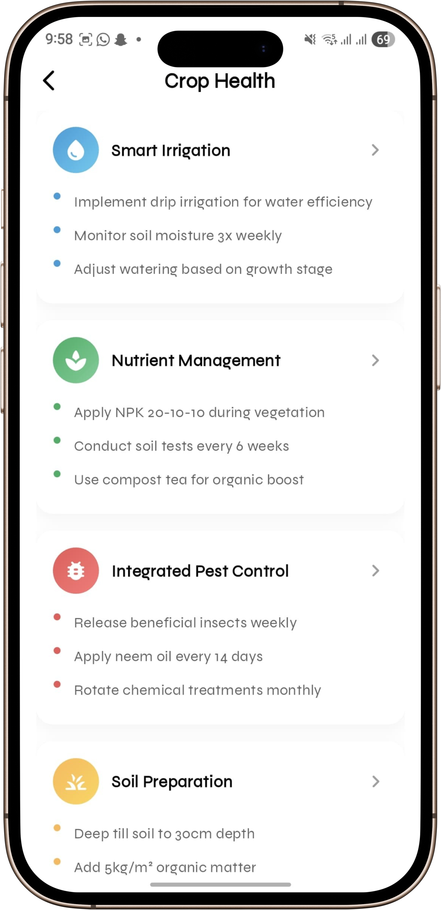

<div align="center">
  
</div>

# AgroVision Mobile Application

**AgroVision** is a feature-rich, cross-platform mobile application designed to revolutionize agricultural management by providing real-time sensor monitoring, disease detection, order and inventory management, and multi-channel communication. Built with Flutter, Dart, and Cubit, the app delivers an intuitive and responsive user experience tailored for modern farming needs.

---

## Table of Contents
1. [Overview](#overview)
2. [Features](#features)
3. [Architecture](#architecture)
4. [Technology Stack](#technology-stack)
5. [Installation](#installation)
6. [Usage](#usage)
7. [Project Structure](#project-structure)
8. [Testing](#testing)
9. [Contributing](#contributing)
10. [License](#license)
11. [Contact](#contact)

---

## Overview
AgroVision bridges field operations with centralized data analysis to enhance farm productivity and decision-making. Key functionalities include:
- **Real-Time Sensor Monitoring**: View live data on soil pH, temperature, humidity, and more.
- **Crop Disease Detection**: Capture and analyze crop images for early disease diagnosis.
- **Task Management**: Efficiently organize and manage your farming activities.
- **Multi-Channel Communication**: Chat with a chatbot or directly with fellow farmers.

## Features
- **Splash & Onboarding** with a smooth and welcoming user experience.
- **Secure Authentication** with instant feedback for login and registration.
- **Dashboard**: Quick actions for crop health, tasks, sensor data, and detection history.
- **Disease Detection**: In-app image processing with confidence scores and recommendations.
- **Detailed Sensor Module**: Real-time and historical data visualization.
- **Chats**: Tabbed interface for an AI chatbot and peer-to-peer communication.
- **Settings**: Profile management, notifications, dark mode, feedback, and logout.

## Architecture
AgroVision employs a **feature-based modular architecture** for scalability and maintainability:
- **Core** (`lib/core`): Contains shared utilities like constants, dependency injection, helpers, networking services, and theming.
- **Features** (`lib/features`): Encapsulated modules where each feature (e.g., `authentication`, `chat`) contains its own API, repository, model, logic (Cubit), and UI.
- **Shared** (`lib/shared`): Common widgets and services that can be reused across different features.
- **Global Models** (`lib/models`): Cross-cutting data structures used by multiple features.

State management is handled via **Cubit**, which decouples the UI from business logic and ensures a responsive, real-time user experience.

## Technology Stack
| Layer                 | Technology                |
|-----------------------|---------------------------|
| Framework             | Flutter                   |
| Language              | Dart                      |
| State Management      | Cubit (BLoC Library)      |
| IDE                   | VS Code, Android Studio   |
| Version Control       | Git / GitHub              |

## Installation
1. **Prerequisites**:
   - Flutter SDK ≥ 3.5.0
   - Dart ≥ 3.0.0
   - Git
2. **Clone the repository**:
   ```bash
   git clone https://github.com/hamdyhaggag/agro_vision.git
   cd agro_vision
   ```
3. **Install dependencies**:
   ```bash
   flutter pub get
   ```
4.  **Set up environment variables**:
    -   Create a `.env` file in the root of your project.
    -   Add any necessary API keys or configuration variables (e.g., `API_BASE_URL=your_api_base_url_here`). This step is crucial for the app to function correctly.
5.  **Run the code generator**:
    ```bash
    flutter pub run build_runner build --delete-conflicting-outputs
    ```
6. **Run on device/emulator**:
   ```bash
   flutter run
   ```

## Usage
- **Login** with your credentials to access the dashboard.
- **Navigate** using the bottom navigation bar to access modules: Home, Disease Detection, Monitoring, and Chat.
- **Open the drawer** for additional features and settings.

### Screenshots

### Splash, Onboarding & Login

| Splash | Onboarding | Login |
|:------:|:----------:|:-----:|
|  |  |  |

### Home

| Home 1 | Home 2 |
|:------:|:------:|
|  |  |

### Crop Health

| Crop Health |
|:-----------:|
|  |

### Sensor Data

| Sensor 1 | Sensor 2 |
|:--------:|:--------:|
|  |  |

### Disease Detection

| Disease 1 | Disease 2 |
|:---------:|:---------:|
|  |  |
| Disease 3 | Disease 4 |
|  |  |

### Chats

| Chat 1 | Chat 2 | Chat 3 |
|:------:|:------:|:------:|
|  |  |  |
| Chat 4 |
|  |

### Tasks & Records

| Task Records |
|:-----------:|
|  |

### Drawer & Analytics

| Drawer | Order 1 | Order 2 |
|:------:|:-------:|:-------:|
|  |  |  |
| Order Management 1 | Order Management 2 |
|  |  |

### Notifications

| Notification 1 | Notification 2 |
|:--------------:|:--------------:|
|  |  |

### Farm Inventory

| Farm Inventory |
|:--------------:|
|  |

### Settings

| Settings 1 | Settings 2 |
|:----------:|:----------:|
|  |  |

## Project Structure
### 1. lib Structure
```